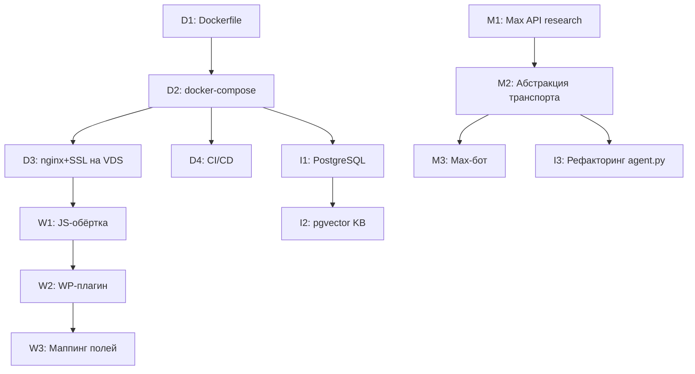

# ROADMAP — План доработки проекта insain-agent

> Последнее обновление: 2026-04-04

## Решения по архитектуре

**Сервер:** разворачивать на той же VDS (netangels.ru, Optima-3), при необходимости добавить ресурсы.
calc_service + бот суммарно ~200-300 MB RAM, укладываются рядом с WordPress.
Внешний субдомен `calc.insain.ru` (A-запись на тот же IP) через nginx reverse proxy.
При росте нагрузки — вынести на отдельный VPS без изменений кода (только DNS + nginx).

**Мессенджеры:** параллельная работа Telegram + Max.
agent.py — единое ядро, транспорт-агностик.
`bot.py` (Telegram/aiogram) и `bot_max.py` (Max SDK) — два независимых транспорта.

---

## Граф зависимостей

---

## Порядок выполнения

1. D1 + D2 (1-2 дня) — Dockerfile и compose
2. D3 (1 день) — nginx, SSL, субдомен на VDS
3. W1 + W2 (3-5 дней) — JS-обёртка и WP-плагин
4. C1, C2, C6 параллельно (по 2-3 дня) — приоритетные калькуляторы
5. W3 (5-7 дней) — маппинг полей на сайте, подключение поштучно
6. C3-C5, C7-C11 (по 1-3 дня) — остальные калькуляторы
7. M1 (1 день) — исследование Max API
8. M2 + M3 (3-5 дней) — абстракция + Max-бот
9. I1-I5 — по мере необходимости

Общая оценка: 6-8 недель (один разработчик), 3-4 недели (два параллельно).

---

## Статус выполнения

Обновляйте чекбоксы по мере закрытия критериев готовности из каждого пункта ниже.

### Инфраструктура (D)

- [x] **D1** — Dockerfile для calc_service и bot_service, `.dockerignore` (2026-04-04)
- [x] **D2** — docker-compose.yml, `.env.example` (2026-04-04)
- [x] **D3** — шаблоны `infra/nginx.conf`, `infra/deploy.sh`; CORS www; DNS/SSL/firewall на VDS вручную (2026-04-04)
- [ ] **D4** — CI/CD (GitHub Actions)

### Сайт и WordPress (W)

- [ ] **W1** — JS-обёртка insain-calc-bridge
- [ ] **W2** — Мини-плагин WordPress
- [ ] **W3** — Маппинг полей для существующих калькуляторов

### Калькуляторы (C)

- [ ] **C1** — Медали (на базе metal_pins)
- [ ] **C2** — Медали акриловые + ленты (laser + inari.pro)
- [ ] **C3** — Брелоки металлические (на базе metal_pins)
- [ ] **C4** — Брелоки полимерные
- [ ] **C5** — Брошюры (на базе notebook)
- [ ] **C6** — Медали спортивные (sportpriz.ru)
- [ ] **C7** — Гравировка на металле (Эльмуна)
- [ ] **C8** — Шелкография на бумаге (Студия 11)
- [ ] **C9** — Пакеты ПВД (РА Логотип)
- [ ] **C10** — Дизайн и верстка (расширение)
- [ ] **C11** — Штампы/печати с автооснасткой

### Max (M)

- [ ] **M1** — Исследование Max Bot API
- [ ] **M2** — Абстракция транспортного слоя бота
- [ ] **M3** — Реализация Max-бота

### Внутренние задачи (I)

- [ ] **I1** — PostgreSQL для логов и истории
- [ ] **I2** — pgvector для KB
- [ ] **I3** — Рефакторинг agent.py
- [ ] **I4** — Исправить 5 падающих тестов bot_service
- [ ] **I5** — Тесты для plaque и poly_sticker_pack

---

## ФАЗА 0: Инфраструктура и деплой

Без деплоя на VPS невозможна интеграция с сайтом. Блокирующая зависимость для всей фазы 1.

### D1. Dockerfile для calc_service и bot_service

- **Приоритет:** ВЫСОКИЙ
- **Сложность:** S
- **Зависит от:** ничего
- **Блокирует:** D2

**Что сделать:**
- Создать `calc_service/Dockerfile` на базе `python:3.12-slim`:
  - Копирование `calc_service/` в контейнер
  - `pip install -r requirements.txt`
  - Entrypoint: `uvicorn main:app --host 0.0.0.0 --port 8001`
  - Volume для `data/` (чтобы администратор мог менять JSON без пересборки)
- Создать `bot_service/Dockerfile` на базе `python:3.12-slim`:
  - Копирование `bot_service/` в контейнер
  - `pip install -r requirements.txt`
  - Entrypoint: `python bot.py`
  - Volume для `logs/`
- Добавить `.dockerignore` в корень

**Критерий готовности:**
- `docker build -t insain-calc calc_service/` собирается без ошибок
- `docker build -t insain-bot bot_service/` собирается без ошибок
- `docker run insain-calc` запускает API на порту 8001, `GET /api/v1/calculators` отвечает 200
- `docker run insain-bot` запускает бота (при наличии TELEGRAM_TOKEN)

**Файлы:**
- `calc_service/Dockerfile` (создать)
- `bot_service/Dockerfile` (создать)
- `.dockerignore` (создать)

---

### D2. docker-compose.yml

- **Приоритет:** ВЫСОКИЙ
- **Сложность:** S
- **Зависит от:** D1
- **Блокирует:** D3, D4, I1

**Что сделать:**
- Создать `docker-compose.yml` в корне проекта (или `infra/docker-compose.yml`)
- Сервисы:
  - `calc-api`: порт 8001, volume `./calc_service/data:/app/data`, restart: always
  - `tg-bot`: depends_on calc-api, env_file `.env`, volume `./logs:/app/logs`
- Общая сеть для межсервисного взаимодействия (`tg-bot` -> `calc-api:8001`)
- `.env` для секретов (TELEGRAM_TOKEN, GEMINI_API_KEY и др.)
- Healthcheck для calc-api: `curl -f http://localhost:8001/api/v1/calculators`

**Критерий готовности:**
- `docker compose up -d` запускает оба сервиса
- `docker compose ps` показывает healthy для calc-api
- Бот отвечает на `/start` в Telegram
- `docker compose down` корректно останавливает всё
- `docker compose logs` показывает логи обоих сервисов

**Файлы:**
- `docker-compose.yml` (создать)
- `.env.example` (создать — шаблон без секретов)

---

### D3. Настройка nginx + SSL на VDS

- **Приоритет:** ВЫСОКИЙ
- **Сложность:** M
- **Зависит от:** D2
- **Блокирует:** W1

**Что сделать:**
- Создать DNS A-запись `calc.insain.ru` -> IP VDS в панели netangels.ru
- Настроить nginx reverse proxy: `calc.insain.ru` -> `localhost:8001`
- Установить SSL через certbot (Let's Encrypt) для `calc.insain.ru`
- Ограничить CORS: разрешить `insain.ru`, `www.insain.ru`
- Подготовить конфиг для будущего деплоя (`infra/nginx.conf`)
- Настроить firewall: порт 8001 только через nginx, не напрямую

**Критерий готовности:**
- `https://calc.insain.ru/api/v1/calculators` возвращает JSON со списком калькуляторов
- SSL-сертификат валиден (проверка через браузер / curl)
- CORS работает: fetch с `insain.ru` проходит, с других доменов — блокируется
- `POST https://calc.insain.ru/api/v1/calc/laser` возвращает расчёт

**Файлы:**
- `infra/nginx.conf` (создать)
- `infra/deploy.sh` (создать — скрипт деплоя на VDS)

---

### D4. CI/CD (GitHub Actions)

- **Приоритет:** СРЕДНИЙ
- **Сложность:** M
- **Зависит от:** D2
- **Блокирует:** ничего

**Что сделать:**
- Создать GitHub Actions workflow:
  - На push в `main`: запустить `pytest calc_service/tests/` и `pytest bot_service/tests/`
  - При успешных тестах: ssh на VDS -> `git pull && docker compose up -d --build`
- Секреты в GitHub: `VDS_HOST`, `VDS_USER`, `SSH_KEY`
- Опционально: отдельный workflow для PR (только тесты, без деплоя)

**Критерий готовности:**
- Push в `main` -> тесты проходят -> автодеплой на VDS
- Падающие тесты блокируют деплой
- В GitHub Actions виден зелёный статус

**Файлы:**
- `.github/workflows/deploy.yml` (создать)

---

## ФАЗА 1: Интеграция с WordPress

### W1. JS-обёртка insain-calc-bridge

- **Приоритет:** ВЫСОКИЙ
- **Сложность:** M
- **Зависит от:** D3
- **Блокирует:** W2

**Что сделать:**
- Реализовать JS-модуль с функциями:
  - `insainCalc(slug, params)` — fetch POST к `https://calc.insain.ru/api/v1/calc/{slug}`, вернуть JSON
  - `updateURLParams(params)` — записать параметры формы в GET-параметры URL через `history.replaceState`
  - `readURLParams()` — прочитать GET-параметры из URL
  - `prefillForm(fieldMap, params)` — заполнить поля ez Form Calculator по маппингу
  - `displayResult(fieldMap, result)` — отобразить результат (price, unit_price, time_ready, share_url) в полях формы
  - `initFromURL()` — при DOMContentLoaded: если есть GET-параметры -> заполнить форму -> запустить расчёт
- Обработка ошибок: таймаут, сеть, 400/404/500 от API
- Индикатор загрузки во время fetch

**Критерий готовности:**
- В браузере: `insainCalc("laser", {quantity: 10, width_mm: 50, height_mm: 50, material: "PVC3"})` возвращает JSON с ценой
- URL обновляется при вводе параметров: `.../calculator/laser/?quantity=10&width_mm=50&...`
- При открытии URL с параметрами: форма заполняется, расчёт выполняется автоматически
- Ошибки API показываются пользователю (не silent fail)

**Файлы:**
- `wp-plugin/js/insain-calc-bridge.js` (создать)
- `wp-plugin/css/insain-calc-bridge.css` (создать — стили индикатора загрузки, ошибок)

---

### W2. Мини-плагин WordPress

- **Приоритет:** ВЫСОКИЙ
- **Сложность:** S
- **Зависит от:** W1
- **Блокирует:** W3

**Что сделать:**
- PHP-плагин для WordPress:
  - Подключает `insain-calc-bridge.js` и `insain-calc-bridge.css` на страницах с калькуляторами
  - Конфигурация: URL API (`calc.insain.ru`)
  - Поддержка data-атрибутов на HTML-элементах для маппинга полей:
    - `data-calc-slug="laser"` — slug калькулятора
    - `data-calc-field-map='{"material":"#field-123","width":"#field-124"}'` — маппинг параметр -> ID поля
- Активация через стандартный интерфейс WordPress (Плагины -> Активировать)

**Критерий готовности:**
- Плагин появляется в списке WordPress-плагинов
- JS подключается только на страницах с формами калькуляторов (не на всех страницах)
- `data-calc-slug` и `data-calc-field-map` корректно считываются JS-обёрткой

**Файлы:**
- `wp-plugin/insain-calc-bridge.php` (создать)

---

### W3. Маппинг полей для существующих калькуляторов

- **Приоритет:** ВЫСОКИЙ
- **Сложность:** L
- **Зависит от:** W2
- **Блокирует:** ничего

**Что сделать:**
- Для каждого калькулятора на сайте insain.ru:
  1. Открыть страницу с формой ez Form Calculator
  2. Определить ID каждого поля формы (через DevTools)
  3. Сопоставить ID поля с именем параметра в API (`GET /api/v1/param_schema/{slug}`)
  4. Создать `data-calc-field-map` JSON
  5. Добавить `data-calc-slug` и `data-calc-field-map` на страницу (через WordPress-редактор или шорткод)
  6. Заменить вызов JS-калькулятора (`calcLaser(params)`) на `insainCalc("laser", params)`
  7. Протестировать: ввод параметров -> расчёт -> share URL -> открытие ссылки
- Начать с 3-5 самых популярных калькуляторов (лазер, листовая печать, широкоформатная печать)
- Затем подключать остальные по приоритету

**Критерий готовности:**
- Все активные калькуляторы на сайте работают через Python API вместо JS
- Share URL работает: менеджер копирует ссылку -> клиент открывает -> форма заполнена, расчёт выполнен
- Результаты расчёта совпадают с предыдущими JS-калькуляторами (допуск +-1%)
- Нет 404/500 ошибок в консоли браузера

**Файлы:**
- Страницы WordPress (редактирование через админку)
- `wp-plugin/js/insain-calc-bridge.js` (может потребоваться доработка)
- `docs/wordpress-integration.md` (обновить: добавить таблицу маппинга для каждого калькулятора)

---

## ФАЗА 2: Новые калькуляторы

Общий паттерн для каждого калькулятора:
1. Python-файл в `calc_service/calculators/`
2. JSON с данными в `calc_service/data/materials/` или `calc_service/data/equipment/`
3. Тесты в `calc_service/tests/test_calculators/`
4. Регистрация в `calc_service/calculators/__init__.py`
5. Продукт в `calc_service/data/products.json`
6. `get_param_schema()`, `get_tool_schema()`, `get_options()`, `calculate()`

Шаблон: `calc_service/calculators/_template.py`
Эталон: `calc_service/calculators/laser.py`
Руководство: `docs/migration-guide.md`

### C1. Медали (на базе metal_pins)

- **Приоритет:** ВЫСОКИЙ
- **Сложность:** M
- **Зависит от:** ничего
- **Блокирует:** ничего

**Что сделать:**
- Создать калькулятор на основе `calc_service/calculators/metal_pins.py`
- Логика: заготовка медали (форма, размер) + штамп + эмали + покрытие + ленты + коробки
- Создать JSON с прайсами поставщика: размеры заготовок, стоимость штампа, цена за единицу по тиражу
- Параметры: тираж, форма медали (круг/звезда/щит), диаметр, кол-во эмалей, тип покрытия, лента (да/нет, цвет), коробка
- Наценка: `get_margin("marginMedals")` (добавить в `data/common.json`)

**Критерий готовности:**
- `POST /api/v1/calc/medals` возвращает корректный расчёт
- `GET /api/v1/param_schema/medals` возвращает схему параметров
- Тесты проходят: `pytest calc_service/tests/test_calculators/test_medals.py -v`
- Продукт зарегистрирован в `products.json`
- Агент в Telegram корректно маршрутизирует запрос "посчитай медали"

**Файлы:**
- `calc_service/calculators/medals.py` (создать)
- `calc_service/data/equipment/medals.json` (создать)
- `calc_service/tests/test_calculators/test_medals.py` (создать)
- `calc_service/calculators/__init__.py` (добавить в CALCULATORS)
- `calc_service/data/products.json` (добавить продукт)
- `calc_service/data/common.json` (добавить marginMedals)

---

### C2. Медали акриловые + ленты (laser + inari.pro)

- **Приоритет:** ВЫСОКИЙ
- **Сложность:** M
- **Зависит от:** ничего
- **Блокирует:** ничего

**Что сделать:**
- Создать калькулятор: лазерная резка акрила (логика из `calc_service/calculators/laser.py`) + заготовки из каталога inari.pro
- Создать JSON с каталогом заготовок inari.pro: формы, размеры, цены
- Параметры: тираж, форма (круг/звезда/прямоугольник), размер, материал акрила, гравировка (да/нет), лента (тип, цвет)
- Расчёт: стоимость заготовки + лазерная резка/гравировка + лента + упаковка
- Наценка: `get_margin("marginMedalAcrylic")`

**Критерий готовности:**
- `POST /api/v1/calc/medal_acrylic` возвращает корректный расчёт
- Тесты проходят
- Заготовки inari.pro корректно загружаются из JSON

**Файлы:**
- `calc_service/calculators/medal_acrylic.py` (создать)
- `calc_service/data/materials/medal_acrylic.json` (создать)
- `calc_service/tests/test_calculators/test_medal_acrylic.py` (создать)
- `calc_service/calculators/__init__.py` (добавить)
- `calc_service/data/products.json` (добавить)
- `calc_service/data/common.json` (добавить marginMedalAcrylic)

---

### C3. Брелоки металлические (на базе metal_pins)

- **Приоритет:** СРЕДНИЙ
- **Сложность:** S
- **Зависит от:** ничего
- **Блокирует:** ничего

**Что сделать:**
- Адаптировать `calc_service/calculators/metal_pins.py`: заменить крепление (булавка/цанга -> кольцо/карабин)
- Использовать тот же `data/equipment/metalpins.json` или создать отдельный JSON, если прайсы отличаются
- Параметры: тираж, форма, размер, эмали, покрытие, тип крепления (кольцо/карабин/цепочка)

**Критерий готовности:**
- `POST /api/v1/calc/keychain_metal` возвращает корректный расчёт
- Тесты проходят

**Файлы:**
- `calc_service/calculators/keychain_metal.py` (создать)
- `calc_service/data/equipment/keychain_metal.json` (создать, если прайсы отличаются)
- `calc_service/tests/test_calculators/test_keychain_metal.py` (создать)
- `calc_service/calculators/__init__.py` (добавить)
- `calc_service/data/products.json` (добавить)

---

### C4. Брелоки полимерные

- **Приоритет:** СРЕДНИЙ
- **Сложность:** S
- **Зависит от:** ничего
- **Блокирует:** ничего

**Что сделать:**
- Адаптировать логику `calc_service/calculators/keychain.py` (акриловые брелоки) на полимерные заготовки
- Другие заготовки, другая технология (не лазер, а заливка/формовка)
- Параметры: тираж, форма, размер, тип полимера, цвет, крепление

**Критерий готовности:**
- `POST /api/v1/calc/keychain_polymer` возвращает корректный расчёт
- Тесты проходят

**Файлы:**
- `calc_service/calculators/keychain_polymer.py` (создать)
- `calc_service/data/materials/keychain_polymer.json` (создать — каталог заготовок)
- `calc_service/tests/test_calculators/test_keychain_polymer.py` (создать)
- `calc_service/calculators/__init__.py` (добавить)
- `calc_service/data/products.json` (добавить)

---

### C5. Брошюры (на базе notebook)

- **Приоритет:** СРЕДНИЙ
- **Сложность:** M
- **Зависит от:** ничего
- **Блокирует:** ничего

**Что сделать:**
- Создать калькулятор на основе `calc_service/calculators/notebook.py`
- Добавить термоклеевой переплёт (КБС) как новый тип binding:
  - Новая функция в `calc_service/common/process_tools.py`: `calc_binding_thermal` (клей, корешок, обрезка тремя сторонами)
- Параметры: тираж, формат (A4/A5/A6/custom), кол-во страниц, бумага обложки, бумага блока, цветность обложки, цветность блока, переплёт (скоба/пружина/КБС)
- Ограничение КБС: минимум ~48 страниц, максимум ~300

**Критерий готовности:**
- `POST /api/v1/calc/brochure` возвращает корректный расчёт для всех типов переплёта
- `calc_binding_thermal` покрыт тестами в `test_process_tools.py`
- Тесты калькулятора проходят

**Файлы:**
- `calc_service/calculators/brochure.py` (создать)
- `calc_service/common/process_tools.py` (добавить `calc_binding_thermal`)
- `calc_service/tests/test_calculators/test_brochure.py` (создать)
- `calc_service/tests/test_process_tools.py` (добавить тест binding thermal)
- `calc_service/calculators/__init__.py` (добавить)
- `calc_service/data/products.json` (добавить)
- `calc_service/data/common.json` (добавить marginBrochure)

---

### C6. Медали спортивные (sportpriz.ru)

- **Приоритет:** ВЫСОКИЙ
- **Сложность:** M
- **Зависит от:** ничего
- **Блокирует:** ничего

**Что сделать:**
- Перенести таблицу цен с sportpriz.ru в JSON
- Расчёт: стоимость заготовки по каталогу + лента + коробка + доставка + наценка
- Параметры: тираж, модель медали (из каталога sportpriz), размер, цвет (золото/серебро/бронза), лента, коробка
- Наценка: `get_margin("marginMedalSport")`

**Критерий готовности:**
- `POST /api/v1/calc/medal_sport` возвращает корректный расчёт
- Цены из JSON совпадают с актуальным прайсом sportpriz.ru
- Тесты проходят

**Файлы:**
- `calc_service/calculators/medal_sport.py` (создать)
- `calc_service/data/equipment/sport_medals.json` (создать — каталог sportpriz)
- `calc_service/tests/test_calculators/test_medal_sport.py` (создать)
- `calc_service/calculators/__init__.py` (добавить)
- `calc_service/data/products.json` (добавить)
- `calc_service/data/common.json` (добавить marginMedalSport)

---

### C7. Гравировка на металле (Эльмуна)

- **Приоритет:** СРЕДНИЙ
- **Сложность:** M
- **Зависит от:** ничего
- **Блокирует:** ничего

**Что сделать:**
- Перенести таблицы подрядчика Эльмуна в JSON
- Расчёт: площадь гравировки * тариф по тиражу + подготовка файла + наценка
- Параметры: тираж, ширина, высота (мм), тип металла (алюминий/латунь/нержавейка), глубина гравировки

**Критерий готовности:**
- `POST /api/v1/calc/engraving_metal` возвращает корректный расчёт
- Расчёт совпадает с ручным расчётом по таблице Эльмуна (допуск +-5%)
- Тесты проходят

**Файлы:**
- `calc_service/calculators/engraving_metal.py` (создать)
- `calc_service/data/equipment/engraving_metal.json` (создать — таблицы Эльмуна)
- `calc_service/tests/test_calculators/test_engraving_metal.py` (создать)
- `calc_service/calculators/__init__.py` (добавить)
- `calc_service/data/products.json` (добавить)

---

### C8. Шелкография на бумаге (Студия 11)

- **Приоритет:** СРЕДНИЙ
- **Сложность:** M
- **Зависит от:** ничего
- **Блокирует:** ничего

**Что сделать:**
- Перенести таблицу подрядчика Студия 11 в JSON
- Расчёт: стоимость за тираж по таблице (зависит от кол-ва цветов, формата, тиража) + подготовка + наценка
- Параметры: тираж, формат (A4/A3/A2/custom), кол-во цветов (1-6), тип краски, бумага (своя/заказчика)

**Критерий готовности:**
- `POST /api/v1/calc/silk_print` возвращает корректный расчёт
- Расчёт совпадает с таблицей Студия 11 (допуск +-5%)
- Тесты проходят

**Файлы:**
- `calc_service/calculators/silk_print.py` (создать)
- `calc_service/data/equipment/silk_print.json` (создать — таблицы Студия 11)
- `calc_service/tests/test_calculators/test_silk_print.py` (создать)
- `calc_service/calculators/__init__.py` (добавить)
- `calc_service/data/products.json` (добавить)

---

### C9. Пакеты ПВД (РА Логотип)

- **Приоритет:** СРЕДНИЙ
- **Сложность:** M
- **Зависит от:** ничего
- **Блокирует:** ничего

**Что сделать:**
- Перенести калькуляторы из Excel подрядчика РА Логотип в Python
- Расчёт: размер пакета * плотность плёнки * тираж + печать (флексография) + вырубка ручек + наценка
- Параметры: тираж, ширина, высота, глубина складки, плотность плёнки (мкм), кол-во цветов печати, тип ручки (вырубная/петлевая/нет)

**Критерий готовности:**
- `POST /api/v1/calc/pvd_bags` возвращает корректный расчёт
- Расчёт совпадает с Excel РА Логотип (допуск +-5%)
- Тесты проходят

**Файлы:**
- `calc_service/calculators/pvd_bags.py` (создать)
- `calc_service/data/equipment/pvd_bags.json` (создать — тарифы РА Логотип)
- `calc_service/tests/test_calculators/test_pvd_bags.py` (создать)
- `calc_service/calculators/__init__.py` (добавить)
- `calc_service/data/products.json` (добавить)

---

### C10. Дизайн и верстка (расширение)

- **Приоритет:** СРЕДНИЙ
- **Сложность:** S
- **Зависит от:** ничего
- **Блокирует:** ничего

**Что сделать:**
- Расширить существующий `calc_service/calculators/design.py`
- Адаптировать таблицу из Excel: виды работ (дизайн макета / верстка / ретушь / адаптация), уровень сложности, часы
- Обновить `data/equipment/design.json` с актуальными ставками и нормативами

**Критерий готовности:**
- `POST /api/v1/calc/design` возвращает расчёт для всех новых типов работ
- Расчёт совпадает с Excel-таблицей
- Существующие тесты не ломаются, новые добавлены

**Файлы:**
- `calc_service/calculators/design.py` (доработать)
- `calc_service/data/equipment/design.json` (обновить)
- `calc_service/tests/test_calculators/test_design.py` (дополнить)

---

### C11. Штампы/печати с автооснасткой

- **Приоритет:** НИЗКИЙ
- **Сложность:** M
- **Зависит от:** ничего
- **Блокирует:** ничего

**Что сделать:**
- Полностью новый калькулятор
- Расчёт: тип оснастки (автоматическая/ручная) * размер клише + изготовление клише + наценка
- Параметры: тираж, тип оснастки (Trodat/Colop/GRM — из каталога), размер оттиска (мм), кол-во строк текста, срочность
- Создать JSON с каталогом оснасток и ценами

**Критерий готовности:**
- `POST /api/v1/calc/stamps` возвращает корректный расчёт
- Тесты проходят
- Каталог оснасток в JSON актуален

**Файлы:**
- `calc_service/calculators/stamps.py` (создать)
- `calc_service/data/equipment/stamps.json` (создать — каталог оснасток)
- `calc_service/tests/test_calculators/test_stamps.py` (создать)
- `calc_service/calculators/__init__.py` (добавить)
- `calc_service/data/products.json` (добавить)

---

## ФАЗА 3: Бот в мессенджере Max

### M1. Исследование Max Bot API

- **Приоритет:** СРЕДНИЙ
- **Сложность:** S
- **Зависит от:** ничего
- **Блокирует:** M2

**Что сделать:**
- Изучить API мессенджера Max: документация, SDK (Python), ограничения
- Определить:
  - Есть ли webhooks или long polling?
  - Формат сообщений (text, markdown, HTML)?
  - Лимиты на длину сообщений
  - Аналог typing indicator
  - Команды бота (/start, /help)
- Написать spike/PoC: минимальный бот, который отвечает на сообщение
- Определить совместимость с текущей архитектурой (agent.py вызывается синхронно через `InsainAgent.chat()`)

**Критерий готовности:**
- Документ `docs/max-bot-research.md` с описанием API, ограничений, архитектурного решения
- PoC-бот отвечает на сообщение в Max

**Файлы:**
- `docs/max-bot-research.md` (создать)

---

### M2. Абстракция транспортного слоя бота

- **Приоритет:** СРЕДНИЙ
- **Сложность:** M
- **Зависит от:** M1
- **Блокирует:** M3, I3

**Что сделать:**
- Выделить из `bot_service/bot.py` общий интерфейс:
  - Абстрактный класс `BotTransport`: `send_message(user_id, text)`, `on_message(callback)`, `show_typing(user_id)`, `start()`, `stop()`
  - `TelegramTransport` — обёртка над aiogram (текущий `bot.py`)
- Обеспечить, чтобы `InsainAgent` не знал о конкретном транспорте
- Текущий `bot.py` продолжает работать без изменений в поведении

**Критерий готовности:**
- `bot.py` использует `TelegramTransport` (рефакторинг без изменения поведения)
- Все существующие тесты bot_service проходят
- Интерфейс `BotTransport` документирован для реализации Max

**Файлы:**
- `bot_service/transport.py` (создать — абстракция + TelegramTransport)
- `bot_service/bot.py` (рефакторинг — использовать transport.py)
- `bot_service/tests/test_agent.py` (проверить, что не ломается)

---

### M3. Реализация Max-бота

- **Приоритет:** СРЕДНИЙ
- **Сложность:** M
- **Зависит от:** M2
- **Блокирует:** ничего

**Что сделать:**
- Реализовать `MaxTransport` (по интерфейсу из M2) на базе Max SDK
- Создать `bot_max.py` — entrypoint для Max-бота (аналог `bot.py`)
- Добавить в `docker-compose.yml` сервис `max-bot`
- Добавить в `.env`: `MAX_BOT_TOKEN`, `MAX_ALLOWED_USERS`

**Критерий готовности:**
- Max-бот отвечает на `/start`, `/help`, `/clear`
- Расчёт через агента работает: "посчитай лазерную резку" -> корректный ответ
- Telegram-бот продолжает работать параллельно без конфликтов
- `docker compose up` запускает оба бота

**Файлы:**
- `bot_service/bot_max.py` (создать)
- `bot_service/transport.py` (добавить MaxTransport)
- `bot_service/Dockerfile.max` (создать — или использовать тот же Dockerfile с другим entrypoint)
- `docker-compose.yml` (добавить сервис max-bot)
- `.env.example` (добавить MAX_BOT_TOKEN, MAX_ALLOWED_USERS)

---

## ФАЗА 4: Улучшения

### I1. PostgreSQL для логов и истории

- **Приоритет:** НИЗКИЙ
- **Сложность:** L
- **Зависит от:** D2
- **Блокирует:** I2

**Что сделать:**
- Реализовать `bot_service/models.py` (SQLAlchemy):
  - `conversations` — история диалогов (user_id, role, content, timestamp)
  - `calc_logs` — логи расчётов (calculator, params, result, timestamp)
  - `wiki_cache` — кэш статей Wiki (slug, title, content, updated_at)
- Реализовать `bot_service/database.py` — подключение через `DATABASE_URL`
- Создать alembic-миграции
- Добавить PostgreSQL в `docker-compose.yml`
- Перевести `knowledge_base.py` с файлового кэша на PostgreSQL

**Критерий готовности:**
- `docker compose up` запускает PostgreSQL + оба сервиса
- История диалогов сохраняется в БД (переживает рестарт контейнера)
- Логи расчётов доступны для анализа через SQL
- KB обновляется из Wiki и хранится в PostgreSQL

**Файлы:**
- `bot_service/models.py` (создать)
- `bot_service/database.py` (создать)
- `alembic/` (создать — миграции)
- `docker-compose.yml` (добавить postgresql сервис)
- `bot_service/knowledge_base.py` (рефакторинг — PostgreSQL вместо файлового кэша)

---

### I2. pgvector для KB

- **Приоритет:** НИЗКИЙ
- **Сложность:** L
- **Зависит от:** I1
- **Блокирует:** ничего

**Что сделать:**
- Добавить расширение pgvector в PostgreSQL
- Генерировать эмбеддинги статей Wiki (через Gemini Embedding API или sentence-transformers)
- Семантический поиск вместо текущего токенного scoring в `knowledge_base.py`
- Таблица `wiki_embeddings` (chunk_id, embedding vector, metadata)

**Критерий готовности:**
- Поиск "как оформить заказ" находит релевантные статьи, даже если слова не совпадают буквально
- Качество ответов агента по Wiki-запросам улучшилось (субъективная оценка менеджеров)

**Файлы:**
- `bot_service/knowledge_base.py` (рефакторинг — семантический поиск)
- `bot_service/models.py` (добавить wiki_embeddings)
- `alembic/` (миграция)

---

### I3. Рефакторинг agent.py

- **Приоритет:** НИЗКИЙ
- **Сложность:** M
- **Зависит от:** M2
- **Блокирует:** ничего

**Что сделать:**
- Разбить `bot_service/agent.py` (~1970 строк) на модули:
  - `agent_routing.py` — роутер, классификация intent, эвристики
  - `agent_api_client.py` — HTTP-вызовы к calc_service
  - `agent_formatting.py` — форматирование результатов, sanitize
  - `agent_heuristics.py` — пересчёт, магниты, print_sheet fast-path
  - `agent.py` — оркестрация (тонкий класс, делегирует в модули)

**Критерий готовности:**
- Все тесты bot_service проходят без изменений
- Поведение агента не изменилось (тестирование в Telegram)
- Каждый модуль < 500 строк

**Файлы:**
- `bot_service/agent.py` (рефакторинг — разбить)
- `bot_service/agent_routing.py` (создать)
- `bot_service/agent_api_client.py` (создать)
- `bot_service/agent_formatting.py` (создать)
- `bot_service/agent_heuristics.py` (создать)
- `bot_service/tests/test_agent.py` (адаптировать импорты)

---

### I4. Исправить 5 падающих тестов bot_service

- **Приоритет:** НИЗКИЙ
- **Сложность:** S
- **Зависит от:** ничего
- **Блокирует:** ничего

**Что сделать:**
- Исправить тестовую фикстуру `InsainAgent`: инициализировать `_param_schemas`, `_user_active_calc_target`, `_calc_tool_by_slug` моками
- Варианты: мок-объект или partial init без HTTP-вызовов к calc_service

**Критерий готовности:**
- `pytest bot_service/tests/ -v` — 79/79 passed (0 failed)

**Файлы:**
- `bot_service/tests/test_agent.py` (исправить фикстуру)

---

### I5. Тесты для plaque и poly_sticker_pack

- **Приоритет:** НИЗКИЙ
- **Сложность:** S
- **Зависит от:** ничего
- **Блокирует:** ничего

**Что сделать:**
- Написать тесты по шаблону существующих (test_badge.py, test_sticker.py):
  - Базовый расчёт, price >= cost, share_url, tool_schema, эталонные значения

**Критерий готовности:**
- `pytest calc_service/tests/test_calculators/test_plaque.py -v` — passed
- `pytest calc_service/tests/test_calculators/test_poly_sticker_pack.py -v` — passed

**Файлы:**
- `calc_service/tests/test_calculators/test_plaque.py` (создать)
- `calc_service/tests/test_calculators/test_poly_sticker_pack.py` (создать)
